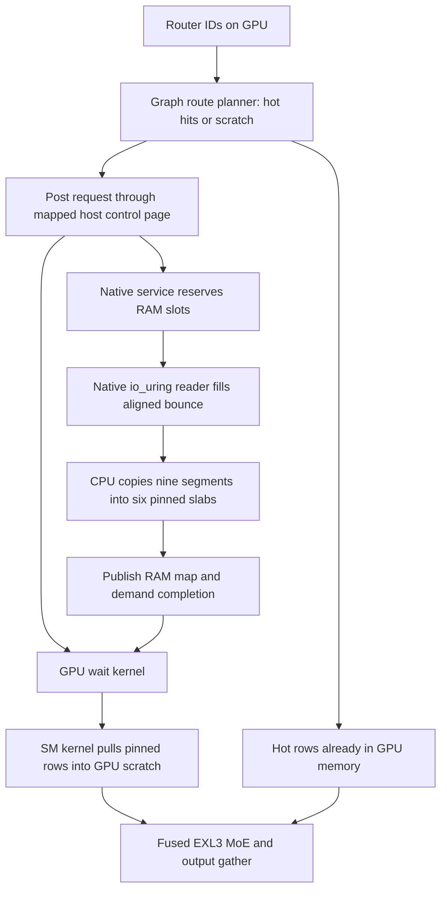

# EXL3 mirrored NVMe → RAM → GPU pipeline: analysis handoff

Date: 2026-09-19. Inspected worktree: `/home/dimitri/data/divix/sglang-nvfp4-worktrees/dsv41`. Commit: `efcef725fc5bb1305f2d7ad9de814ab659903807`, branch `dsv41`.

**Analysis only. No implementation or tests changed.** This report distinguishes **observed** code behavior, **historical** repository measurements, and **proposed** optimizations. Recommendations are not benchmark results.

## 1. Main conclusions

1. **Wire mirrors into the native graph reader first.** The graph RAM-miss service has its own C++ io_uring reader and source-only read tables. Improving the Python row source alone does not accelerate graph demand misses or native advisory reads.
2. **Batching is already present, but the pipeline is still serial at important boundaries.** Native execution waits for all I/O in a batch, splits the bytes into pinned slabs, publishes the request, then the GPU gathers all weights before fused compute.
3. **The largest structural opportunities are earlier requests, incremental row completion, and overlapping storage, RAM packing, and H2D.** Queue flags and launch tuning should follow measurement of these stages.
4. **A cold exact-demand dependency cannot be made latency-free.** Until routing is known, the required expert cannot generally be fetched exactly. Hide latency with useful prediction, independent requests, or hit-expert compute; preserve a correct demand fallback.
5. **Existing generic async controls are not sufficient for EXL3.** Spec-only EXL3 promotions use synchronous pinned-cache loading; generic GPU residency/doorbell support is refused; the generic side-stream pull assumes dense host rows and its extra GPU slot is rejected by the EXL3 fused wrapper.
6. **Introduce explicit slot leases and completion generations before increasing concurrency.** The current serialized protocol supplies safety that would disappear if waits were simply removed.

### Verified scope

The mirror implementation is present in this worktree. Its splitter, row reader, mirror source, environment selection, tests, and saved CPU benchmark artifacts were inspected. The native RAM-miss service, streamer, prefetch, residency, and GPU transfer implementations were compared against the initial workspace; the relevant native graph behavior is unchanged. The initial missing-source limitation is resolved.

[ReadSplit](/home/dimitri/data/divix/sglang-nvfp4-worktrees/dsv41/python/sglang/srt/layers/moe/exl3_read_split.py:35) apportions whole pages, places leftover pages on the largest-weight root, and preserves zero-size parts. [read_split](/home/dimitri/data/divix/sglang-nvfp4-worktrees/dsv41/python/sglang/srt/layers/moe/exl3_row_reader.py:128) submits all nonempty parts in one reader call, addressing disjoint contiguous regions of each bounce row. [The mirror source](/home/dimitri/data/divix/sglang-nvfp4-worktrees/dsv41/python/sglang/srt/layers/moe/exl3_mirror_row_source.py:29) validates copies at construction; [first open](/home/dimitri/data/divix/sglang-nvfp4-worktrees/dsv41/python/sglang/srt/layers/moe/exl3_row_reader.py:49) checks the actual opened mirror size against its source. These are implemented features to preserve.

[Format selection](/home/dimitri/data/divix/sglang-nvfp4-worktrees/dsv41/python/sglang/srt/layers/moe/exl3_expert_format.py:202) reads `SGLANG_MOE_EXPERT_MIRROR_DIRS` and `SGLANG_MOE_EXPERT_MIRROR_WEIGHTS`. Only the listed mirror roots serve split payloads; the original checkpoint directory is required for layout/validation and cannot itself be listed as a mirror. A zero part skips that root's read and open in `read_split`; source construction still requires every configured root and its files to validate. Thus zero is a traffic-selection mechanism, not startup tolerance for an absent configured drive. Distinct root paths are checked, but two distinct directories can still reside on the same physical drive.

This local host reports an RTX 3060 Laptop GPU (6 GiB), driver 580.173.02, one Crucial P3 Plus NVMe, and kernel 7.0.0-31-generic. No target-server benchmark, destructive storage test, CUDA build, or model inference was performed.

## 2. Complete copy and dependency path

### Eager / host-driven path

[expert_stream._read_rows](/home/dimitri/data/divix/sglang-nvfp4-worktrees/dsv41/python/sglang/srt/layers/moe/expert_stream.py:672) calls the source's synchronous `read()`. [SynchronousSubmit](/home/dimitri/data/divix/sglang-nvfp4-worktrees/dsv41/python/sglang/srt/layers/moe/expert_row_source.py:141) also executes the read immediately and returns a completed ticket; its name does not imply background I/O.

[Exl3ShardRowSource.read](/home/dimitri/data/divix/sglang-nvfp4-worktrees/dsv41/python/sglang/srt/layers/moe/exl3_shard_row_source.py:144) batches expert superset reads through [Exl3RowReader](/home/dimitri/data/divix/sglang-nvfp4-worktrees/dsv41/python/sglang/srt/layers/moe/exl3_row_reader.py:23) and [the general C++ reader](/home/dimitri/data/divix/sglang-nvfp4-worktrees/dsv41/python/sglang/kernels/jit/csrc/io/uring_file_reader.cpp:1). Data lands in reusable page-aligned CPU bounce storage, then tensor slices copy the required segments into six destination tensors. These are pinned-cache slabs when a host tier is installed, or pinned output staging on the pageable route.

The mirror subclass overrides only the read hook: its parts land directly in their final positions within the same bounce row. There is **no extra mirror-assembly copy and no duplicated whole-row read**. The inherited bounce-to-tensor scatter is the CPU copy to optimize. One application-level reader call can still require multiple io_uring kernel submissions for queue limits, short reads, or retries.

GPU-originated row indices can require D2H plus current-stream synchronization at [expert_stream.py:660](/home/dimitri/data/divix/sglang-nvfp4-worktrees/dsv41/python/sglang/srt/layers/moe/expert_stream.py:660). The pageable-output route reads into pinned staging then issues six `copy_(non_blocking=True)` calls at [expert_stream.py:1163](/home/dimitri/data/divix/sglang-nvfp4-worktrees/dsv41/python/sglang/srt/layers/moe/expert_stream.py:1163). Chunked eager compute consumes staged rows before reusing them at [exl3.py:471](/home/dimitri/data/divix/sglang-nvfp4-worktrees/dsv41/python/sglang/srt/layers/quantization/exl3.py:476).

With O_DIRECT, the intended payload route is storage DMA → user bounce → CPU segment copies → pinned destination → GPU. Buffered mode adds the filesystem page-cache path. Page alignment alone neither pins memory for CUDA nor registers it with io_uring.

### CUDA graph demand path

The native route bypasses the Python mirror reader, even when mirror environment variables select it for eager reads:

Evidence:

- [exl3_ram_miss_tables](/home/dimitri/data/divix/sglang-nvfp4-worktrees/dsv41/python/sglang/srt/layers/moe/exl3_ram_miss.py:44) reconstructs `path, offset, length, start` from the layout, independently of the row source. [ensure_started](/home/dimitri/data/divix/sglang-nvfp4-worktrees/dsv41/python/sglang/srt/layers/moe/exl3_ram_miss.py:299) passes these tables to `Exl3RamMissHost`.
- [Exl3RamMissRowBackend.translate](/home/dimitri/data/divix/sglang-nvfp4-worktrees/dsv41/python/sglang/srt/layers/moe/exl3_ram_miss.py:230) posts and immediately waits on the graph stream. [PinnedTierRowBackend.post](/home/dimitri/data/divix/sglang-nvfp4-worktrees/dsv41/python/sglang/srt/layers/moe/expert_row_plan.py:368) then runs the host-to-GPU segment kernel.
- [Native RowReader](/home/dimitri/data/divix/sglang-nvfp4-worktrees/dsv41/python/sglang/kernels/jit/csrc/moe/exl3_ram_miss_host.cpp:138) owns file descriptors, an io_uring, and a separate aligned bounce allocation. The defaults are ring depth 16 and eight bounce rows.
- [The completion loop](/home/dimitri/data/divix/sglang-nvfp4-worktrees/dsv41/python/sglang/kernels/jit/csrc/moe/exl3_ram_miss_host.cpp:216) drains the batch before [CPU memcpy](/home/dimitri/data/divix/sglang-nvfp4-worktrees/dsv41/python/sglang/kernels/jit/csrc/moe/exl3_ram_miss_host.cpp:263). [serve](/home/dimitri/data/divix/sglang-nvfp4-worktrees/dsv41/python/sglang/kernels/jit/csrc/moe/exl3_ram_miss_host.cpp:860) publishes slots only after the read operation finishes.
- [exl3.py:463](/home/dimitri/data/divix/sglang-nvfp4-worktrees/dsv41/python/sglang/srt/layers/quantization/exl3.py:463) gathers before fused compute. VRAM hits avoid payload copies, but their compute is still behind the layer's miss wait.
- [expert_cache_transfer.cuh](/home/dimitri/data/divix/sglang-nvfp4-worktrees/dsv41/python/sglang/kernels/jit/csrc/moe/expert_cache_transfer.cuh:35) uses GPU load/store instructions over mapped host slabs. This is SM-driven PCIe transfer, not a CUDA copy-engine operation.

The worker is asynchronous relative to Python, and the graph replays device operations without calling Python for each miss. Nevertheless, the GPU's dependent stream stalls. [The wait kernel](/home/dimitri/data/divix/sglang-nvfp4-worktrees/dsv41/python/sglang/kernels/jit/csrc/moe/exl3_ram_miss.cuh:216) polls with system acquire loads and nanosleep; it is a small single-block wait, **not a kernel occupying every SM**.

## 3. Storage and CPU optimization priorities

### A. Share one mirror-aware read description across eager and native paths — highest priority

Introduce a native-consumable extent plan with file identity, source offset, length, destination offset, row identity, and completion generation. Both Python and C++ paths must consume the same validated layout/mirror policy. An unchanged public row-source interface does not provide this automatically: the native table builder presently never asks it for extents.

Verify native demand and advisory traffic on both drives, not just standalone `read_split()`. The Python path already validates mirrors; extend the same first-open size validation to descriptors actually used by native I/O. Retain exact short-read and EOF validation. Size equality detects truncation, not different same-size contents; immutable checkpoint identity or an offline manifest/checksum is appropriate if byte-identical mirrors are not otherwise guaranteed.

Two parts per row need independent CQE accounting, including zero-part omission and retries. CQE identity should include request, row, part, and generation; do not map both parts to an indistinguishable row completion. Never publish a row until every required byte has completed successfully.

Unify EOF handling as part of sharing the engine: the general reader's short-positive-read retry loop and the native reader's expected-existing-bytes termination differ. Add a focused O_DIRECT test for an aligned request crossing non-block-aligned EOF before reusing either behavior. An invalid unaligned tail retry is a review hypothesis, not a failure reproduced here. Mirror I/O errors currently fail the batch; alternate-root retries would require completion-safe destination ownership.

### B. Turn the native reader into a bounded completion-driven pipeline

Keep one owner for each ring initially. Submit demand extents, reap CQEs, and schedule newly available work without insisting the ring become empty between application batches. Preserve ring cleanup on errors; current retry/drain handling and fault tests are valuable, not missing features.

First incremental implementation:

1. Retain the current six pinned slabs and segment layout.
2. Use at least two bounce groups with explicit ownership.
3. Pack completed row A while I/O for row B is in flight.
4. Publish each fully packed row independently.
5. Release a bounce row only after its CPU reader has finished.
6. Let H2D begin on ready rows while later rows are still being read.

Polling CQEs and then executing a long memcpy on the sole I/O owner can delay new submissions. Compare a completion/packing worker or carefully bounded packing work with a simpler single-owner loop. More threads are useful only if they create measured stage overlap.

Native publication currently happens after the entire missing set. Consequently, optimizing CQE processing alone will not overlap H2D: the device delivery protocol also needs per-row readiness or smaller independently completed requests.

### C. Evaluate removing the full-row CPU copy

A strong candidate is a page-aligned **raw-row pinned RAM cache**: read each expert's aligned superset directly into its final RAM slot, and have the GPU segment gather interpret the row offsets. This removes bounce-to-six-slab CPU copying and naturally accommodates split-drive reads into disjoint regions of the same slot.

This requires extending the segment copier's source-stride/offset representation; it currently indexes per-name slabs. Account for alignment prefix, padded row stride, EOF tail, dropped `mul1` scalars, and pointer alignment. Original packed EXL3 data is not uniformly 16-byte aligned; moving packing off CPU can worsen GPU load alignment. Compare against a repacked, versioned, aligned disk format if repacking is acceptable.

Do not simply issue nine O_DIRECT reads into existing tensor segments. Their offsets, sizes, and destination addresses need not meet filesystem/device direct-I/O alignment. Do not remove the CPU layout conversion by silently introducing an equal or larger GPU conversion without measuring it.

Alternative: retain the final slab layout and only overlap packing. This has lower integration risk and is an appropriate baseline against raw-row caching.

### D. Tune drive scheduling against the application workload

For one row of B bytes, equal drive startup times, and effective bandwidths b1 and b2, a bandwidth-proportional split is approximately B1 = B·b1/(b1+b2), rounded to legal pages. Real completion is closer to max(q1 + B1/b1, q2 + B2/b2), where q includes queueing and startup. Under load, equal halves need not finish together.

Compare:

- Whole-row assignment across drives when several experts are outstanding.
- Within-row splitting for a small number of large demand rows.
- Hybrid assignment based on outstanding bytes and recent completion times.
- One-drive operation via legal zero-size parts.

The saved workload supports retaining static 1:1 as the initial policy; do not build adaptive control merely because the interface allows it. Broader batch-size and asymmetric-load measurements should justify any change. Whole-row assignment avoids waiting for two drives for every row and can improve tail latency; splitting can improve single-row latency. Neither is a universal winner. Keep split decisions stable over a request, avoid tiny extents, and use measured per-drive queueing rather than static peak specifications.

A single submit batches work but does not guarantee simultaneous physical starts or optimal device queue depth. Size the ring for **extents**, retries, demand headroom, and staging capacity. Two subranges are not twice the payload bytes.

### E. Registered resources and io_uring options are secondary experiments

Use persistent pre-opened descriptors, preallocated request metadata, and fixed buffers if measurements show per-I/O mapping overhead. io_uring buffer registration and CUDA host pinning serve different purposes; one does not replace the other. Measure registration/memlock cost and steady-state benefit with the deployed kernel. [liburing registration documentation](https://github.com/axboe/liburing/blob/master/man/io_uring_register.2).

The general reader already implements registered buffers and READ_FIXED, and attempts SINGLE_ISSUER plus DEFER_TASKRUN. The EXL3 shard source does not register its bounce; the native graph reader implements neither optimization. Reuse proven infrastructure rather than claiming registration support is absent repository-wide. A deferred-taskrun owner must enter the kernel regularly to make progress; inspecting CQ memory alone is insufficient. The general reader is also bound to its creating thread, so moving its calls to arbitrary workers is not safe without changing ownership. See [general reader setup](/home/dimitri/data/divix/sglang-nvfp4-worktrees/dsv41/python/sglang/kernels/jit/csrc/io/uring_file_reader.cpp:45), [registration](/home/dimitri/data/divix/sglang-nvfp4-worktrees/dsv41/python/sglang/kernels/jit/csrc/io/uring_file_reader.cpp:139), and [thread ownership](/home/dimitri/data/divix/sglang-nvfp4-worktrees/dsv41/python/sglang/kernels/ops/io/uring_file_reader.py:168).

Keep default interrupt-driven I/O as the baseline. Compare SQPOLL, supported IOPOLL, and appropriate task-run flags only after the pipeline is instrumented. They require compatible filesystem/device/kernel behavior and may consume CPU without improving large-row throughput. Preserve handling of partial submission, soft errors, short reads, cancellation, and teardown. [liburing setup documentation](https://github.com/axboe/liburing/blob/master/man/io_uring_setup.2).

Check NUMA locality of buffer first-touch, CPU packing, GPU, and both drives on the target. A shared PCIe root or inter-socket path can prevent disk and GPU bandwidth from adding independently.

After larger costs are addressed, cache static split plans by aligned length and precompute row extent metadata. The Python reader constructs four metadata tensors per call; the native reader allocates request/retry vectors per batch. Reuse those structures on their owning thread. These are smaller targets than the measured full-row scatter.

## 4. CUDA, PyTorch, and graph optimization priorities

### A. Copy-engine H2D versus current SM gather

Benchmark the existing vectorized SM copy against native asynchronous DMA from pinned rows. The current kernel already uses adjacent 16-byte units where aligned and distributes warps across rows; do not assume it is a naive byte copier. Its fixed default is eight blocks of 256 threads at [expert_cache_transfer.cuh:13](/home/dimitri/data/divix/sglang-nvfp4-worktrees/dsv41/python/sglang/kernels/jit/csrc/moe/expert_cache_transfer.cuh:13). Sweep launch sizes and active-row counts against simultaneous compute.

DMA may free SM resources and deliver better bandwidth, but arbitrary device-selected source/destination rows cannot simply be substituted into captured memcpy nodes: their address selection is not a device gather. Native-service DMA needs the GPU destination slot and request generation in its descriptor, plus a safe completion bridge into the graph.

Two implementation candidates:

- Keep SM gather for RAM hits and graph-dynamic selection; stage predicted rows on a captured side stream after resolving and leasing RAM slots.
- Extend the native worker with a dedicated nonblocking CUDA transfer stream. Submit H2D as each row becomes ready; query completion events and publish generation-tagged GPU readiness only after DMA completes.

The second candidate is an architectural change. Define producer/consumer dependencies and validate forward progress under active graph waits before deploying it. Do not wait for a CUDA event that has not yet been recorded for the intended generation; a previous event record is not a future completion promise.

Pinned memory and `non_blocking=True` permit host-asynchronous submission; they do not create overlap with dependent compute on the same stream. Preserve source lifetime until actual completion, and use explicit cross-stream dependencies. [PyTorch CUDA semantics](https://docs.pytorch.org/docs/main/notes/cuda.html).

### B. Post early, join at the true consumer

Graph capture preserves dependency edges; it does not invent useful overlap. A copy posted immediately before its wait remains on the critical path.

An EXL3-aware lookahead pipeline should identify likely future misses, read them into RAM early, optionally stage sufficiently confident candidates into dedicated GPU slots, and join only when actual routing needs them. Prediction determines fetch priority, never which experts execute. A wrong or late prediction must fall back to exact demand.

[ExpertGpuPullPipeline](/home/dimitri/data/divix/sglang-nvfp4-worktrees/dsv41/python/sglang/srt/layers/moe/expert_gpu_pull.py:96) demonstrates a captured ready/copy/done fork/join. It is a design reference, not a working EXL3 switch: [PrefetchPuller](/home/dimitri/data/divix/sglang-nvfp4-worktrees/dsv41/python/sglang/srt/layers/moe/expert_prediction/serving/runtime.py:214) builds segments from dense layer tensors, and [exl3_fused_moe_for](/home/dimitri/data/divix/sglang-nvfp4-worktrees/dsv41/python/sglang/srt/layers/quantization/exl3_fused_moe.py:157) rejects its extra slot. Extend pinned-slot resolution, protection, pointer tables, remaps, and graph-state lifetimes together.

Start with NVMe → RAM prediction; it can remain useful across multiple tokens. Add RAM → GPU prediction only when its timeliness and useful-byte ratio justify extra GPU capacity and link traffic.

### C. Avoid blocking promotions and repeated host ownership barriers

[stage_reassign](/home/dimitri/data/divix/sglang-nvfp4-worktrees/dsv41/python/sglang/srt/layers/moe/expert_hot_cache.py:688) routes EXL3's spec-only tensors through synchronous loading even where generic asynchronous promotion exists. [Pinned promotion chunks](/home/dimitri/data/divix/sglang-nvfp4-worktrees/dsv41/python/sglang/srt/layers/moe/expert_hot_cache.py:475) call current-stream synchronization before releasing host ownership. [before_host_use](/home/dimitri/data/divix/sglang-nvfp4-worktrees/dsv41/python/sglang/srt/layers/moe/exl3_ram_miss.py:337) synchronizes queued device work and pauses the native service.

Replace this, eventually, with asynchronous admission/copy tickets, RAM leases, destination generations, and atomic publication of completed promotions at safe graph boundaries. Retain the old resident mapping until replacement data is complete. Bound promotion traffic so it cannot starve demand.

Generic GPU residency updates and the doorbell are rejected for this format by [require_graph_gather_support](/home/dimitri/data/divix/sglang-nvfp4-worktrees/dsv41/python/sglang/srt/layers/moe/expert_format.py:271) and [manager setup](/home/dimitri/data/divix/sglang-nvfp4-worktrees/dsv41/python/sglang/srt/layers/moe/expert_hot_cache.py:1104). Enabling existing flags is not an implementation of asynchronous EXL3 promotion.

There is also a smaller avoidable metadata transfer: [promotion preparation](/home/dimitri/data/divix/sglang-nvfp4-worktrees/dsv41/python/sglang/srt/layers/moe/expert_hot_cache.py:553) starts with Python expert IDs, constructs a GPU tensor, and [ensure_rows](/home/dimitri/data/divix/sglang-nvfp4-worktrees/dsv41/python/sglang/srt/layers/moe/expert_stream.py:317) converts it back to a Python list. Keep CPU IDs for host admission and fill GPU plans separately.

### D. Compute ready experts while cold experts load — later experiment

A layer's hot expert contributions can theoretically execute while missing experts are fetched, followed by a deterministic reduction. This requires splitting the current fused operation into valid groups, separate accumulation, and explicit joins. Measure lost fusion and extra launches against hidden storage latency.

[shared_temps](/home/dimitri/data/divix/sglang-nvfp4-worktrees/dsv41/python/sglang/srt/layers/quantization/exl3_fused_moe.py:30) deliberately shares temporary buffers across layers because compute is serial. Concurrent groups or requests need separate in-flight temp/output storage. Validate route weighting, `keep`, reduction order, numerical parity, and timeout behavior. Exact next-layer computation still depends on this layer's full output.

### E. Keep graph waiting mechanisms conservative

Moving a wait onto another stream only helps if independent work can execute before the consumer joins. Replacing the small polling kernel alone cannot eliminate NVMe latency.

Driver stream memory operations are an optional experiment, subject to deployed-device support, capture integration, memory visibility, sequence wrap, and timeout design. NVIDIA warns that their ordering is not visible to CUDA's scheduler; CUDA-visible dependencies must also describe CUDA task ordering. They are not a drop-in deadlock-free replacement. [CUDA stream memory operations](https://docs.nvidia.com/cuda/cuda-driver-api/group__CUDA__MEMOP.html).

A CUDA host callback is not an appropriate place to run storage waits and call CUDA for H2D: later stream work waits for the callback, and it must not call CUDA APIs. Use an independent native worker. [CUDA host functions](https://docs.nvidia.com/cuda/archive/13.0.0/cuda-c-programming-guide/index.html#host-functions-callbacks).

## 5. Required ownership and correctness contract

Proposed state progression:

`FREE → IO_IN_FLIGHT → RAM_READY → H2D_IN_FLIGHT → GPU_READY → CONSUMED/RETAINED → EVICTABLE`

Track RAM and GPU state independently where multiple consumers exist. Every request needs stable storage for descriptors, a generation, per-extent completion, and explicit row ownership.

- Do not overwrite RAM until all CPU packing, SM reads, and DMA readers finish. CUDA allocator lifetime handling does not prevent an application from mutating a still-live pinned buffer.
- Do not overwrite GPU slots until the last graph consumer completes. A map entry is published only after payload completion.
- Keep inclusive RAM protection for GPU-hot experts unless the cache policy is explicitly redesigned.
- Retain demand priority and promote a pending speculative read to demand ownership instead of issuing a duplicate.
- Cancellation abandons interest, not device/kernel ownership. Drain or confirm cancellation before buffer reuse; late CQEs must not complete a recycled generation.
- Preserve release/acquire publication, slot-map visibility, timeout fail-stop, and watchdog behavior. Current control-page fencing is intentional.
- A whole-request completion word cannot be advanced past an unfinished earlier request if requests start completing out of order. Use per-request completion or a contiguous completed frontier.
- Independent overlapping graph executions require separate mutable plan/control buffers, generations, scratch, events, and fused temps. The present shared state assumes serialization.
- Audit the noncoherent host loads at [expert_cache_transfer.cuh:17](/home/dimitri/data/divix/sglang-nvfp4-worktrees/dsv41/python/sglang/kernels/jit/csrc/moe/expert_cache_transfer.cuh:17). PTX defines `ld.global.nc` as using a noncoherent read-only cache. This is **not a confirmed corruption bug**: slabs are intended to remain immutable during a gather. Establish supported publication/cache behavior and stress repeated slot overwrites and graph replay before increasing concurrency. [NVIDIA PTX ISA](https://docs.nvidia.com/cuda/parallel-thread-execution/#data-movement-and-conversion-instructions-ld-global-nc).

The existing [native reader fault tests](/home/dimitri/data/divix/sglang-nvfp4-worktrees/dsv41/test/registered/unit/kernels/test_exl3_ram_miss_split.py:100), [thread tests](/home/dimitri/data/divix/sglang-nvfp4-worktrees/dsv41/test/registered/unit/kernels/test_exl3_ram_miss_thread.py:1), and [GPU graph tests](/home/dimitri/data/divix/sglang-nvfp4-worktrees/dsv41/test/manual/dsv41/test_exl3_ram_miss_graph_gpu.py:1) are starting points. Their presence is not a claim that they ran in this analysis.

## 6. Prefetch scheduling

Native Option F is separate from generic GPU side-stream prefetch. [The post kernel](/home/dimitri/data/divix/sglang-nvfp4-worktrees/dsv41/python/sglang/kernels/jit/csrc/moe/exl3_ram_miss.cuh:180) constructs next-layer advice from stored prior routes. The native service performs speculative reads one whole row at a time and checks for demand between batches. A large in-flight advisory row can delay new demand; doubling drive throughput does not fix all such queueing.

With advice enabled, [the armed condition](/home/dimitri/data/divix/sglang-nvfp4-worktrees/dsv41/python/sglang/kernels/jit/csrc/moe/exl3_ram_miss.cuh:174) requires a CPU acknowledgement even when no RAM read is needed. Measure that hit-path cost against avoided misses. This acknowledgement participates in eviction ordering: removing it requires an equivalent ownership mechanism.

The current [serve completion](/home/dimitri/data/divix/sglang-nvfp4-worktrees/dsv41/python/sglang/kernels/jit/csrc/moe/exl3_ram_miss_host.cpp:860) releases reserved slots when an advisory operation is abandoned, including completed rows from earlier sub-batches in that operation. Incremental admission can retain completed useful rows while canceling the remainder.

Use separate demand and speculative byte budgets, cap speculative in-flight work, and prioritize by expected latency saved before the deadline. Evaluate smaller advisory chunks only against their extra I/O overhead. Demand-priority scheduling cannot instantaneously preempt an already issued drive command.

Measure useful-and-on-time recall, retained reuse, canceled bytes, evicted useful rows, and demand tail latency. Prediction accuracy alone does not establish a speedup.

## 7. Measurement plan and realistic bounds

### Saved mirror benchmark evidence

The saved [six-repetition JSON](/home/dimitri/data/divix/sglang-nvfp4-worktrees/dsv41/analysis/dsv41-drive/mirror-rows-20260920T032017Z.json) records O_DIRECT, layer 19, six repetitions of 48 one-row calls, with the first read per arm/shard separated from steady-state statistics. Times are milliseconds:

| CPU row-read arm | p50 total | Mean total | Mean read | Mean CPU split |
|---|---:|---:|---:|---:|
| Original nvme2 source | 9.623 | 9.903 | 8.225 | 1.604 |
| nvme0 only | 5.916 | 5.985 | 4.319 | 1.589 |
| nvme4 only | 6.007 | 8.082 | 6.400 | 1.599 |
| Mirrored 1:1 | 4.164 | 4.223 | 2.550 | 1.584 |

This supports mirror benefit in the Python source and makes CPU packing a substantial target: about 37.5% of mirrored mean latency. The read stage remains larger at about 60%; the older benchmark note's claim that disk is no longer dominant is too strong. `read_ns` includes reader overhead and is not a pure device service measurement. The run's explicit p50 ≤ 4.0 ms gate failed.

The [benchmark](/home/dimitri/data/divix/sglang-nvfp4-worktrees/dsv41/analysis/dsv41-drive/bench_mirror_rows.py:247) uses plain pageable CPU destination tensors, not the production pinned tier, and times one `source.read()` at a time. It excludes CRC validation from timing and records cross-arm matching bytes. It does not measure GPU transfers, native graph reads, or multi-row queue depth. The nvme4 result includes a warming/outlier warning; do not derive an adaptive policy from its pooled mean alone.

The saved burst tests favor retaining static 1:1 for that tested load: [1:1 run](/home/dimitri/data/divix/sglang-nvfp4-worktrees/dsv41/analysis/dsv41-drive/burst-5050.json) p50 5.126 ms versus [1:0 run](/home/dimitri/data/divix/sglang-nvfp4-worktrees/dsv41/analysis/dsv41-drive/burst-1-0.json) 5.644 ms. These are separate runs, so treat the comparison as suggestive rather than a paired controlled result. The single-arm 1:0 artifact's `bytes_match` cannot establish cross-arm parity by itself. No burst workload was launched during this analysis.

Do not use the isolated-row ratio as a measured graph throughput gain. The native mirror bypass must be fixed first, and pinned packing, GPU-link traffic, cache state, and promotion boundaries must be measured end to end.

Historical context only: [DSV41_REFERENCE.md §18](/home/dimitri/data/divix/sglang-nvfp4-worktrees/dsv41/DSV41_REFERENCE.md) and [the previous cache analysis](</home/dimitri/data/divix/sglang-nvfp4/DSV4.1 nvme_cache_performance.md>) record a 391 ms decode trace with approximately 190 ms RAM-miss service wait, 128 ms RAM → GPU gather, and 16.8 ms compute. The service wait is not pure disk time. These are previous experiments on another setup, not this checkout's measured baseline.

Even the optimistic arithmetic of halving all 190 ms gives about 296 ms, or 1.32× improvement for that trace, with everything else unchanged. This is an illustration, not a prediction: dual drives do not halve CPU copying, queueing, or fixed overhead, and changed cache/prefetch behavior changes traffic.

For M cold rows and three stages with per-row times tIO, tPack, and tH2D, an ideal balanced pipeline approaches tIO+tPack+tH2D+(M−1)·max(tIO,tPack,tH2D), versus M·(tIO+tPack+tH2D) when strictly serial. This simplified model assumes independent resources and identical rows. It demonstrates why pipelining matters, not a hardware guarantee.

On the target server:

1. Record GPU/PCIe generation and negotiated width, NUMA/root-port topology, both drives, filesystem/direct-I/O alignment, CUDA/PyTorch/liburing/kernel versions, launch flags, and cache capacities.
2. Baseline cold RAM misses, warm RAM misses, all-GPU hits, mixed requests, eager prefill, and graph decode separately. Preserve corpus, seed, cache capacity, warmup, residency policy, and predictor across comparisons.
3. Timestamp request post/observation, queue admission, submit, each drive CQE, row packing, RAM publication, H2D start/end, consumer wait, compute, and promotion boundaries. Separate host/GPU clocks correctly; do not subtract unsynchronized clocks.
4. Compare one-drive, 50/50, measured weighted split, whole-row load balancing, and hybrid scheduling at active counts 1/2/4/6/8 and larger eager batches. Include an asymmetric or slowed drive.
5. Compare current batch barriers, overlapped packing, direct-to-raw-RAM, SM launch variants, and DMA. Measure isolated bandwidth and simultaneous compute/storage contention.
6. Report tokens/s and p50/p95/p99 step latency, bytes per useful expert, per-drive bytes/queue depth, CPU cost, pinned memory, GPU copy/compute occupancy, prefetch utility, and promotion stalls.
7. Keep profiling separate from final unprofiled timings; graph node tracing and synchronized metrics can perturb the pipeline.

Correctness gates for future implementation: zero split part; page rounding; EOF/truncation; reverse CQE order; short positive reads; partial submits; soft/hard errors; demand arriving during advisory; shutdown with pending I/O/H2D; canceled late completion; generation wrap; full RAM cache; repeated overwrite/replay; and simultaneous replays if supported. Compare bytes and model outputs against the existing path.

GPUDirect Storage is a later alternative, not the initial recommendation. It may bypass CPU staging on supported systems, but compatibility mode can still use CPU buffers; direct-to-GPU also changes this pipeline's inclusive RAM-cache behavior. Prove native support and benefit before considering a separate cold-miss path. [NVIDIA GDS overview](https://docs.nvidia.com/gpudirect-storage/overview-guide/index.html).

## 8. Suggested implementation order

| Order | Work | Acceptance evidence |
|---|---|---|
| 1 | Unify validated native/eager mirror extent plans and counters | Both native graph demand and advisory reads use the intended drives; byte parity |
| 2 | Add stage timing and matched target-server baselines | Attribution of wait to queueing, I/O, CPU packing, H2D, promotions |
| 3 | Overlap native I/O and packing; incremental completion and bounded demand priority | Lower cold-miss latency without stale slots or tail regression |
| 4 | Compare raw pinned-row cache versus current layout; registered-resource and queue tuning | Reduced CPU bytes/time and net token-latency benefit |
| 5 | Add EXL3-aware leases and async promotions; benchmark DMA and SM transfer | No host boundary stalls or lifetime races; actual copy/compute overlap |
| 6 | Integrate timely RAM/GPU lookahead with real EXL3 slot tables | Useful ready-before-demand rows outweigh speculative traffic |
| 7 | Evaluate split hit/miss compute, multi-request overlap, or GDS | End-to-end gains after accounting for memory, fusion, and numerical behavior |

The first implementation should preserve model arithmetic and the six-tensor layout while proving native mirror integration and stage overlap. Raw-row caching and compute restructuring are separate experiments so their costs and benefits remain attributable.

## 9. Handoff verification

Static source analysis covered the general reader, shard source, format selection, native tables/reader/service, CUDA request/wait/copy path, streamer, fused consumer, prefetch, and residency integration. Storage, CUDA, and prefetch were inspected in separate review lanes. Official CUDA/PTX, PyTorch, liburing, and GDS documentation informed API constraints.

No performance gains are claimed, and no target-hardware tests were run. Mirror source is now verified; native mirrored graph execution and target end-to-end performance remain untested. Existing unrelated workspace files were left untouched.
